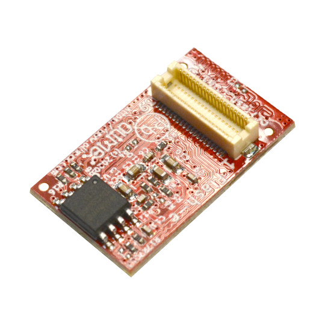
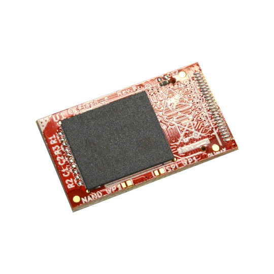

# Flash-e
External eMMC and SPI Flash module

https://www.olimex.com/Products/OLinuXino/Accessories/Flash-e32Gs16M/

## Licensee
* Hardware is released under CERN Open Hardware Licence Version 2 - Strongly Reciprocal
* Software is released under GPL V3 Licensee
* Documentation is released under CC BY-SA 4.0
